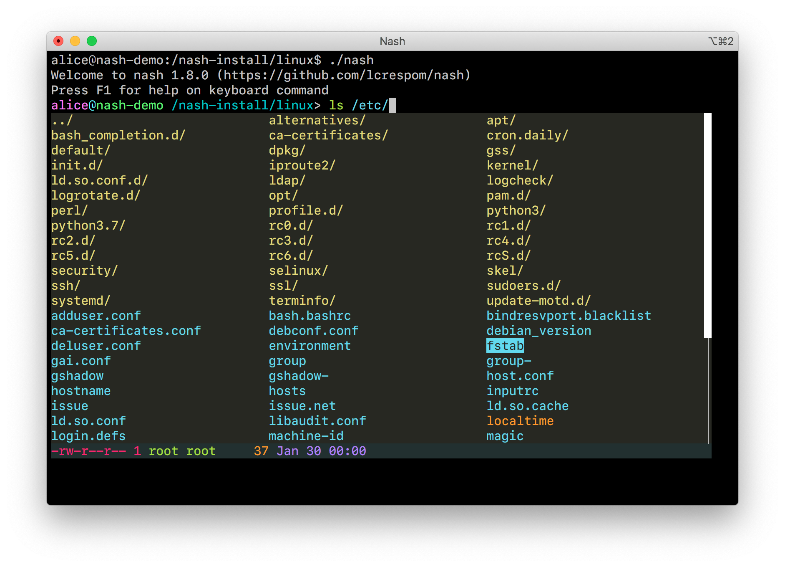

# node-terminal-menu
Simple menu widgets for the terminal, in JavaScript.

Two widgets are provided:
- A vertical menu, using one line per item
- A tabular menu, displaying items in a specified number of columns

The widgets expect keyboard events to be handled by the
[keypress](https://github.com/TooTallNate/keypress) module, which must
be set up by the application. See the examples for more details.


# Installation
As usual with node:
```
npm install node-terminal-menu --save
```

# Examples
See the code examples in the `tests` directory. There are different example
programs with different level of complexity, illustrating all the different
features of the widgets.

## Screenshot
The screenshot below is taken from the [Nash](https://github.com/lcrespom/nash)
project, which uses the table menu widget to let the user select files,
directories and other elements.



# Usage

## Vertical menu
```
const { verticalMenu } = require('node-terminal-menu')

let menu = verticalMenu(config)
```

**Config object**:
- **items**: required - an array of strings with the list of menu items to display.
- **done**: required - a callback function that will be invoked when the user selects an item. The item index will be passed as a parameter to the callback.
- **selection**: optional - the preselected menu item. Defaults to 0.
- **height**: optional - maximum number of rows to display. If the height is smaller than the number of
    items, scrolling is used (but no scroll bar is displayed).
- **decorate**: optional - if present, this function will be invoked when displaying each menu item, e.g.
    to colorize it. It receives two parameters: the menu item string and a boolean indicating whether
    the item is selected or not, and returns the decorated menu item.
    The default implementation renders unselected menu items without decoration and selected ones in reverse color.
    Notice that menu items can be passed already decorated in the required **items** parameter, but this
    property is useful in case the amount of items is large and the cost of decorating all of them before
    opening the menu could keep the user waiting.

The call to `verticalMenu` returns a menu object with the following methods and properties:
- **keyHandler**: a key event listener that can be used to listen to `keypress` events. That way, when the user presses arrow keys, the listener will update the menu selection accordingly, and when the user presses *return* or *escape*, the **done** callback will be invoked.
- **update**: a method that receives a config object and updates the menu according to the new configuration.
- **selection**: the current selection index.


## Table menu
```
const { tableMenu } = require('node-terminal-menu')

let menu = tableMenu(config)
```

**Config object**:
- **items**: required - an array of strings with the list of menu items to display.
- **done**: required - a callback function that will be invoked when the user selects an item. The item index will be passed as a parameter to the callback.
- **columns**: required - the number of columns in the table.
- **columnWidth**: required - the width of each column.
- **selection**: optional - the preselected menu item. Defaults to 0.
- **height**: optional - maximum number of rows to display. If the height is smaller than the number of
    items, scrolling is used, and an optional scrollbar can be displayed using the **scrollBarCol** property.
- **scrollBarCol**: optional - if this property is present and the **height** property is smaller than the
    total number of rows, then a vertical scroll bar is displayed at the position indicated by the value of
    this property.
- **descs**: optional - an array of description strings, corresponding to each item. If present, the selected item
    description will be displayed at the bottom of the table.
- **descRows**: optional - maximum number of description lines. If not present, it is calculated by searching
    inside the descriptions.
- **colors**: optional - an object with function properties that, if present, will be invoked
    to add terminal escape codes to give color to different parts of the menu.
    - **item**: function to colorize each menu item.
    - **selectedItem**: function to colorize the selected menu item
    - **scrollArea**: function to colorize the vertical scroll area.
    - **scrollBar**: function to colorize the scroll bar.
    - **desc**: function to colorize the item's description, if present.


The call to `tableMenu` returns a menu object, with the same behavior as the call to `verticalMenu`.

### Computing the table menu layout

The **columns** and **columnWidth** properties can be provided by the user, or can be computed via the `computeTableLayout` helper function:

```
let { rows, columns, columnWidth } = computeTableLayout(items)
```

The function takes the array of items and computes the number of rows, columns and their width based on the number of items and the width of the longest item. Apart from the items parameter, it supports two more optional parameters:
- **gap**: the separation between columns - defaults to 2
- **totalWidth**: the table width - defaults to the number of columns of the terminal
